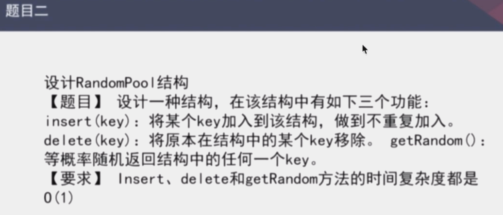

1.哈希函数【非常重要】  
(经典哈希函数)性质  
- 输入域input无穷大
- 输出域output有穷大
- 输入一样，则输出一样 
- 必然会发生碰撞
- 给很多不同输入，输出域会均匀分布[最重要]  
``相同输入，相同输出，不同输入，不同输出``

怎样做出相互独立的1000个哈希函数？  
MD5散列的中间16结果是16位的16进制 ；
16位中的每一位之间相互独立。
MD5前8位 + i * MD5后8位(i 从1到1000)，这之间也是相互独立的，数学上可以证明。  

2.哈希表  
- 经典的哈希表结构：数组+单链表
因为会均匀分布，可以认为链也是几乎均匀长的


平时用的时候可以认为哈希表的增删改查的时间复杂度是O(1);  
扩容的时候确实会有代价，理论上达不到O(1);
但是有很多优化技巧，比如离线扩容。  

- jvm的实现？【数组 + 红黑树】  
桶不是单链表，是一颗红黑树，平衡搜索二叉树。

  
- 解：用2个hashmap <Key,index>  <index,Key>  

   
3.[题目三]认识布隆过滤器(位图)  
  
有100亿条url的黑名单,每条url 64字节，至少需要640G，给定一条url判断是否在黑名单中？  
布隆过滤器是bit数组，存在一定失误率  
```java
//以下实现修改第index位为1
int[] arr = new int[1000]; //这表示32 * 1000个bit
int index = 30000; //要修改的bit位
int intIndex = index / 32;
int bitIndex = index % 32;
arr[intIndex] = arr[intIndex] | (1 << bitIndex);
```
- 加入到布隆过滤器里面去
    - 用k个相互独立哈希函数作用每个url，结果 % bit数组长度m，结果位置1
- 如何查一条url是否在黑名单中？
    - 用这k个哈希函数作用给定url，如果每个位都是1，则就称此url在黑名单中，否则不在。
- k个哈希函数怎么选择？
    - 上面讲过，很容易
    - 公式 `k = ln2 * m / n = 0.7 * m / n `向上取整
- 失误率？
    - 因为bit数组长度小时，极端情况所有位置1，就会存在误杀
    - bit数组长度m越大，失误率p越小，否则越大
    - 真实失误率公式 (1 - e 的 - (n * k / m)次方)的k次方[因为k和m会调整]
- bit数组这个空间要开多大？
    - 和单条url长度无关，和不同url个数[样本量n]有关
    - 和预期失误率p有关
    - 公式 `m = - (n * lnp) / (ln2)`的平方
      
4.[题目四]一致性哈希（一种服务器的设计）   
经典服务器抗压结构（负载均衡），用hash mod实现，在增加或减少服务器时数据迁移问题  
原来hash在扩容时，全部数据要重新算，这在扩容服务器时迁移代价很大。

- 如何减少迁移代价？
    - 不用mod的办法，比如对Ip地址hash一下，打到2的64次方这个域内，每台机器负责一个范围。
    这样做不到负载均衡，因为hash函数是离散的，在机器数量少的时候，怎么办？
- 如何在减少迁移代价的同时保持负载均衡？
    - 用虚拟结点：比如有3台机器，给每台机器分配1000个虚拟结点，增加1台机器时，增加1000个虚拟结点，从原来那3台中拿。
 
