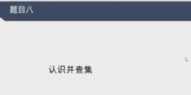
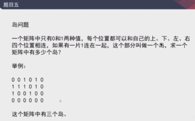
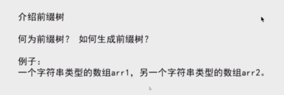

   
 并查集的功能  
 - 查2个元素是否属于同一个集合  
 - 合并2个元素在的集合  
 结论： 只要查询和合并的次数和整体逼近O(N)及以上，那么平均下来单次查询和合并的时间复杂度O(1)  
   
 - 单CPU解法
     - 感染法
 - 多CPU解法 
     + 边界信息如何合并？用并查集
     + 感染法 + 边界并查集处理
 - 并查集是面试高频内容之一吗？
     - 并查集这个结构不冷门，但是考得不是特别多。  
     
###前缀树TrieTree  
  
####功能 
- 查前缀  
- 查前缀的词频多少  
- 查某个字符串是否在里面  

###贪心策略  
碰到贪心的题目，别太纠结策略怎么对，通常证明很困难，有对数器去验证。

